# De multifondos a fondos generacionales

[](https://github.com/tav0-m/AFP/actions/workflows/ci.yml)
[](https://tav0-m.github.io/AFP/)

**Documento de trabajo:** [docs/DOCUMENTO_TRABAJO.md](docs/DOCUMENTO_TRABAJO.md) · **Tablero de resultados:** [tav0-m.github.io/AFP](https://tav0-m.github.io/AFP/) · **Simulador personal:** [tav0-m.github.io/AFP/simulador.html](https://tav0-m.github.io/AFP/simulador.html)
### Riesgo, regímenes de mercado y pensiones en Chile (2002–2026)

El 1 de abril de 2027 los cinco multifondos (A–E) serán reemplazados por diez **fondos generacionales**
asignados por año de nacimiento, con un esquema de premios y castigos para las AFP.
Este proyecto usa 24 años de datos oficiales para responder tres preguntas:

1. **¿Qué nos enseñan los multifondos?** Rentabilidad *real*, riesgo y el costo de cambiarse de fondo.
2. **¿Un fondo de ciclo de vida da mejores pensiones que el esquema actual?** Simulación Monte Carlo de la vida laboral completa.
3. **¿Morderán los premios y castigos?** Cuánto se han desviado históricamente las AFP frente a las bandas oficiales.

---

## Hallazgos principales

<!-- HALLAZGOS:INICIO -->
| # | Hallazgo | Evidencia |
|---|---|---|
| 1 | La inflación se lleva ~3,9 puntos al año: la rentabilidad real es mucho menor que la publicitada. | Fondo A: 9,9% nominal vs 5,8% real; Fondo E: 6,8% vs 2,8% (ago-2002 a ago-2026). |
| 2 | El Fondo E no es un refugio: su peor caída real fue mayor que la del D y similar a la del C. | Máx. caída real: C -24,4%, D -21,9%, E -24,3%. |
| 3 | Desde 2019 el mercado chileno opera en un régimen nuevo, nunca visto antes. | El HMM (3 estados, BIC) detecta un régimen que domina desde 05-2019; en él el Fondo E tiene volatilidad real de 8,9% (vs 2,4% en calma) y la correlación C–E subió a 0,81 (IC 90%: 0,69 a 0,89). Bootstrap paramétrico (200 réplicas): volatilidad del E en ese régimen entre 5,9% y 10,2%; el régimen se recupera (>50% de los meses desde el quiebre) en 92% de las réplicas. |
| 4 | Con la trayectoria oficial de los fondos generacionales, el ciclo de vida supera al fondo por defecto actual. | Hombre: mediana 14,8 vs 10,1 UF (+46%); percentil 5: 7,2 vs 6,0 UF. Sin extrapolar sobre el Fondo A: +40%. Con historias alternativas (bootstrap por bloques) el IC 90% es -14% a +120%: ver hallazgo 9. |
| 5 | Cambiarse de fondo reaccionando a las caídas no mejora la pensión esperada y suele costar. | Mediana -4,9% y percentil 5 -8,3% vs el por defecto (≈15 traspasos). En la historia 2002-2026 la misma regla quedó en +2,3%: un solo camino no basta para juzgar. Con historias alternativas el IC 90% es -8,7% a +8,5%. |
| 6 | La brecha de género es estructural, incluso con el mismo sueldo y la misma estrategia. | Por defecto: hombre 10,1 UF vs mujer 6,5 UF (-36%): 5 años menos de ahorro y mayor longevidad (CNU 234 vs 194). |
| 7 | Las bandas de premios y castigos son ~3 veces más anchas que la dispersión histórica entre AFP. | El 95% de las desviaciones de 36 meses vs pares es menor a 0,83%; con banda ±2,4% solo 0,2% de los AFP-meses habría quedado fuera, y con la banda de transición de ±4,0% (abr-2028 a mar-2031), 0,0%. El incentivo dependerá de cuánto difiera la cartera de referencia de lo que hoy invierten las AFP. |
| 8 | Las dos conclusiones sobre estrategias resisten 13 supuestos alternativos, y reaccionar más rápido cuesta más. | El ciclo de vida supera al por defecto en 91%–93% de los escenarios en todos los casos (mediana +28% a +51%). La regla reactiva pierde en la mediana en los 13 casos: -9,7% si reacciona ante caídas de 4% (≈26 traspasos) y -0,9% si espera caídas de 10%. |
| 9 | La ventaja del ciclo de vida es, en el fondo, una apuesta a la prima de la renta variable, y 24 años de historia no la aseguran. | Remuestreando la historia por bloques (200 historias), la prima real del A sobre el E va de -2,0% a +7,2% (IC 90%) y explica la ventaja del ciclo de vida (correlación 0,94). El ciclo de vida gana en la mediana en 86% de las historias; cuando la prima es negativa, pierde. |
| 10 | Con las expectativas de mercado actuales, la ventaja del ciclo de vida es real pero mucho menor que la histórica. | Recentrando los escenarios en el consenso 2026 (renta fija UF 2,52%, renta variable global 4,4% real): Fondo A 4,1% y E 2,7% real/año; ciclo de vida vs por defecto +12% en la mediana (vs +46% con la historia), percentil 5 -2%, gana en 68% de los escenarios. Sin prima de crecimiento: -1%. La probabilidad de alcanzar una tasa de reemplazo de 40% es 10% (por defecto) y 25% (ciclo de vida). |
| 11 | La reforma de 2025 cambia más la pensión que cualquier estrategia de inversión: la tasa de reemplazo se duplica. | Fondo por defecto, consenso 2026. Hombre: solo con el 10% del trabajador, tasa de reemplazo mediana 27% (10% llega a 40%); con cotización del empleador, rentabilidad protegida y PGU, 58% (98% llega a 40%). Mujer (PGU desde los 65): 17% → 43%. La PGU es progresiva: con sueldo de 15 UF la tasa total es 69% y con 60 UF, 40%. |
| 12 | El glidepath oficial está muy cerca del óptimo, y la PGU justifica llegar al retiro con más riesgo. | Maximizando la utilidad CRRA de la pensión total (hombre, consenso 2026, escenarios de prueba), el mejor glidepath de la familia supera al oficial en solo +0,3% a +3,1% de pensión equivalente cierta (aversión γ de 2 a 5); el fondo por defecto de la ley queda -9% a -1% bajo el oficial. Con γ = 3, el óptimo llega al retiro con 70% en crecimiento si se cuenta la PGU y 40% sin ella (el oficial, 29%): la PGU actúa como un bono. |
| 13 | En la población real la pensión depende sobre todo del ingreso y de las lagunas: la PGU la vuelve muy progresiva. | Microsimulación de 20 mil personas con ingreso y densidad calibrados con la SP (consenso 2026, fondo por defecto): tasa de reemplazo total mediana 63% en hombres y 49% en mujeres (solo con el 10%: 27% y 14%). Del quintil 1 al 5 la tasa total baja de 91% a 50% (hombres). La PGU es más de la mitad de la pensión en 56% de los casos de mujeres. El ciclo de vida sube la pensión total +3% en el quintil 1 y +9% en el 5: la PGU amortigua su efecto en los de menores ingresos. |
| 14 | La edad de pensión es la principal causa de la brecha de género, por sobre las lagunas y el sueldo. | La pensión total mediana de una mujer es 36% menor que la de un hombre. Descomposición de Shapley: densidad de cotización 9,7 pp; nivel de ingreso 6,6 pp; edad de pensión (60 vs 65) 14,8 pp; esperanza de vida (tabla de mortalidad) 4,1 pp. El factor más importante es «Edad de pensión (60 vs 65)», con 41% de la brecha. |
| 15 | Pagar más comisión no compra más rentabilidad: ninguna AFP rindió lo suficiente para compensar su comisión. | Las comisiones van de 0,46% (Uno) a 1,45% (Provida) del sueldo. Como se cobran aparte de la cotización, la diferencia equivale a dejar de ahorrar 9,9% de la pensión autofinanciada (0,96 UF al mes para el hombre tipo; 135 vs 43 UF pagadas en la vida laboral). Para compensarla, Provida necesitaría rendir 0,41% más al año; entre nov-2019 y ago-2026 rindió -0,16% frente a sus pares (t vs equilibrio -2,1). La que más rindió (Capital, +0,25%) tampoco alcanzó su equilibrio (0,41%), y ninguna diferencia de rentabilidad es significativa. |
| 16 | Los regímenes mejoran la predicción del mes siguiente, pero las variables macro no ayudan a anticiparlos. | Validación fuera de muestra 2015-2026 (140 meses, reestimación anual): el HMM supera a una normal sin regímenes en +0,74 de log-score por mes (Diebold-Mariano p = 0,001). Agregar IPC, TPM, dólar e Imacec a las transiciones (TVTP) no mejora: -0,001 por mes (p = 0,98). Dentro de muestra, una TPM que sube 1 desviación estándar eleva la probabilidad de pasar de la calma a la crisis de 4% a 16%, pero el quiebre de 2019 ocurrió una sola vez: no hay transiciones suficientes para aprender qué lo gatilla. |
<!-- HALLAZGOS:FIN -->

Todas las cifras se recalculan con `python run_pipeline.py`; esta tabla la **reescribe el pipeline** desde los datos.

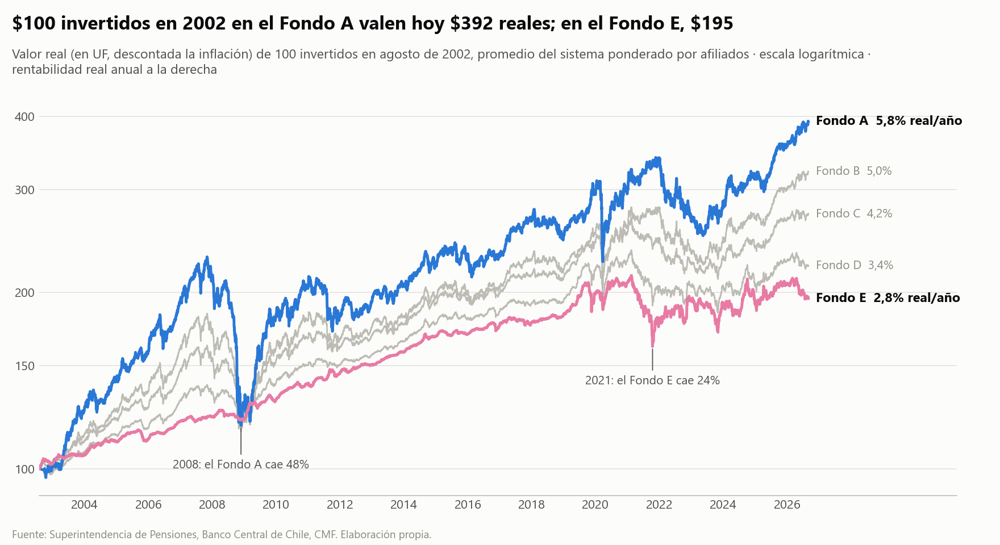
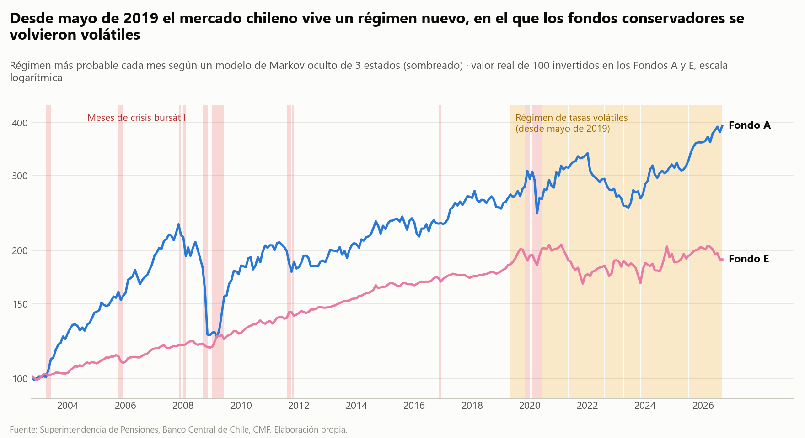
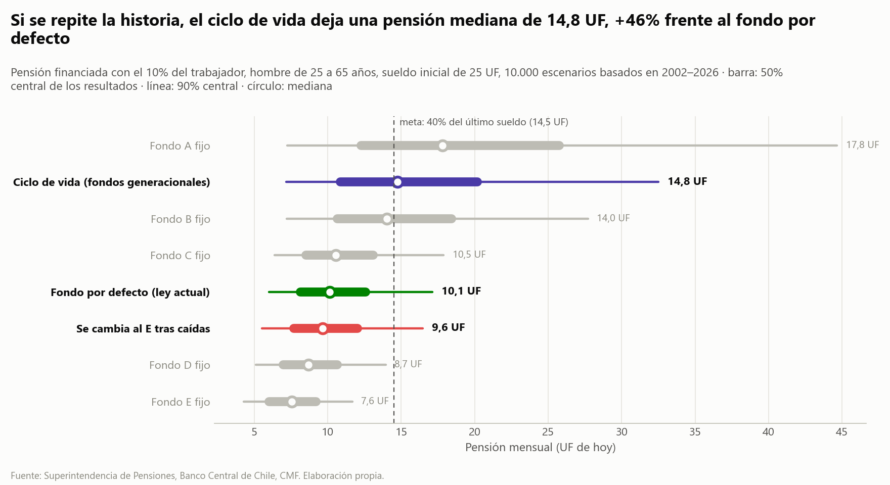
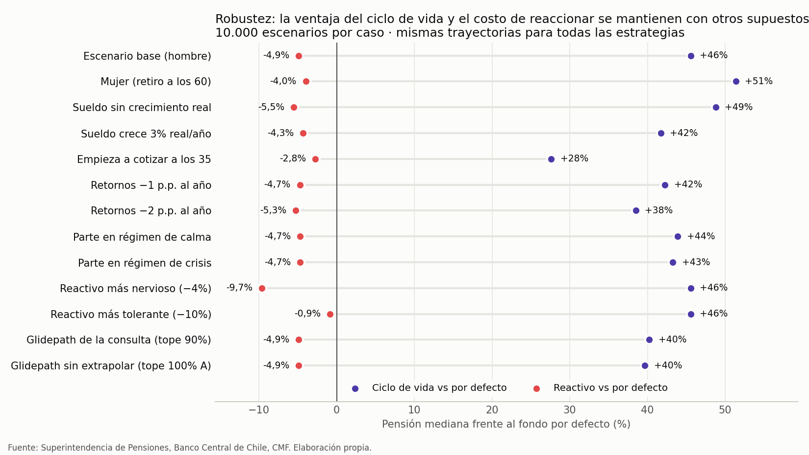
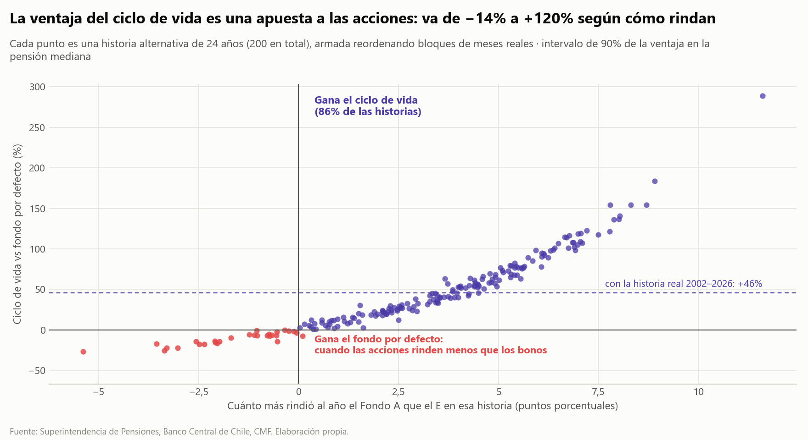
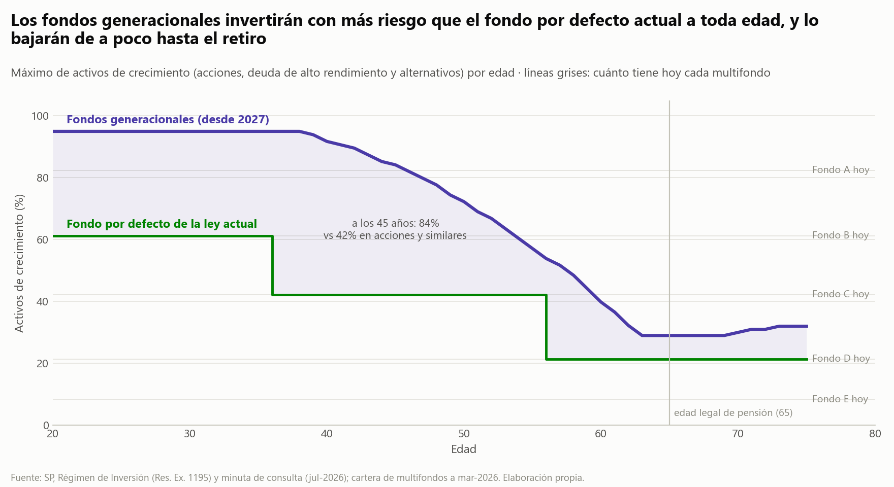
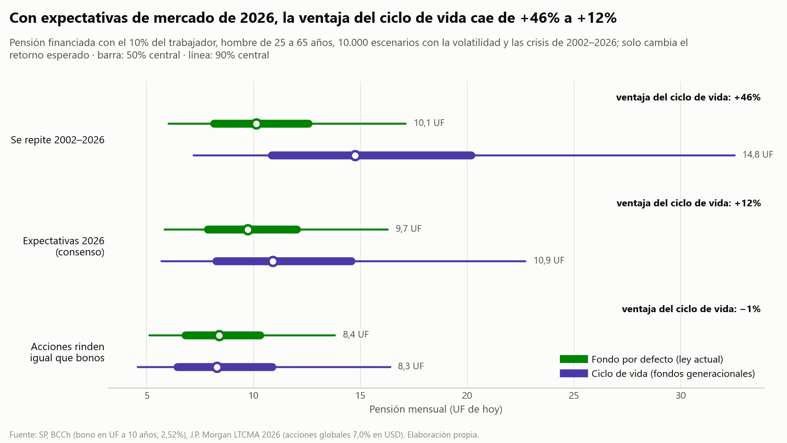
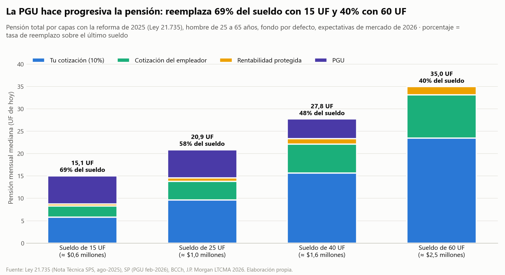
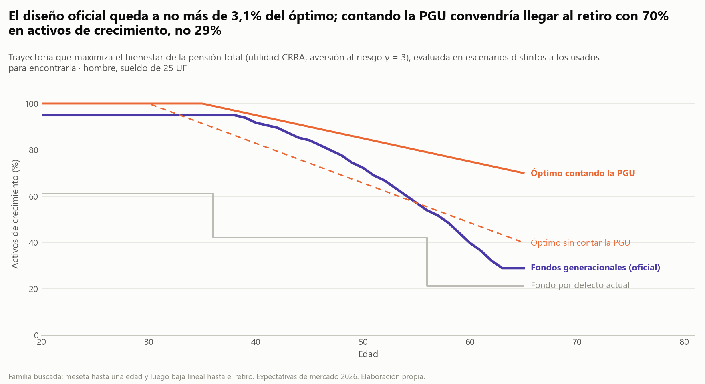
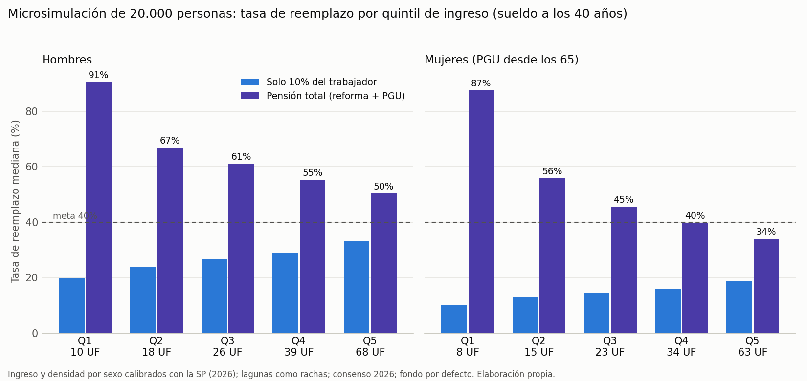
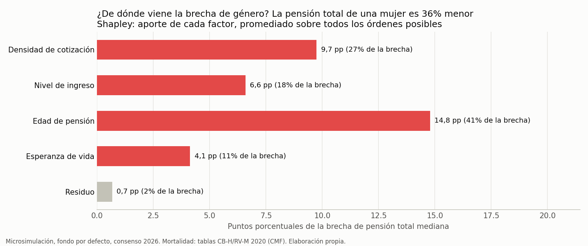
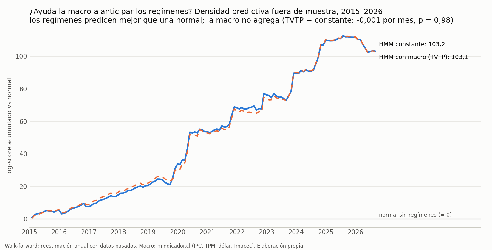
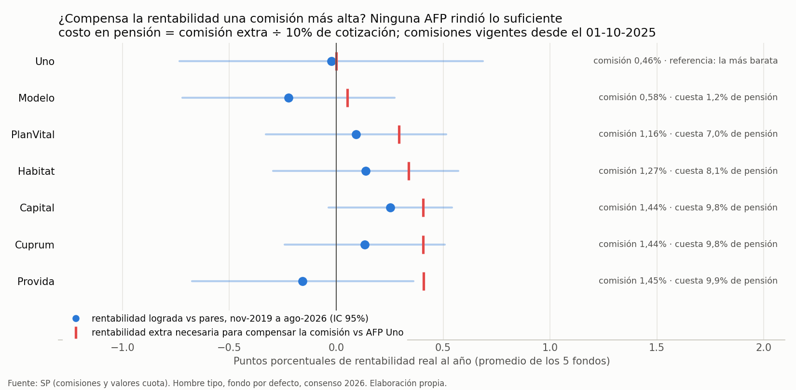

---

## Cómo ejecutar

```bash
pip install -r requirements.txt       # o: make instalar
python run_pipeline.py                # o: make pipeline   (~3 min con 8 núcleos, todo desde los datos crudos)
python -m unittest discover -s tests  # o: make pruebas    (41 pruebas, ~20 s)
```

Con Docker (mismo resultado en cualquier máquina):

```bash
docker build -t proyecto-afp .
docker run --rm -v "$PWD/reports:/app/reports" proyecto-afp
```

Actualizar la UF (requiere cuenta gratuita en la Base de Datos Estadísticos del Banco Central):

```bash
export BCCH_USER="..." BCCH_PASS="..."         # nunca en el código
python scripts/descarga_bcentral.py --salida data/raw
```

Abrir el **tablero de resultados**: `app/tablero.html` (gráficos interactivos de todos los hallazgos) y el
**simulador personal**: `app/index.html`. Ambos son autocontenidos y los regenera el pipeline.

La integración continua (`.github/workflows/ci.yml`) corre las pruebas y el pipeline completo en cada cambio
y una vez por semana, para detectar a tiempo si una fuente cambia de formato.

## Estructura

```
proyecto-afp/
├── run_pipeline.py            # orquestador de punta a punta
├── Makefile · Dockerfile · .github/workflows/ci.yml
├── src/afp/
│   ├── config.py              # TODOS los supuestos (editables), incluida la grilla de robustez
│   ├── etl_valores_cuota.py   # etapa 1: parser del CSV por bloques de la SP + detección de fusiones
│   ├── retornos.py            # etapa 2: UF, retornos reales, ponderación por afiliados
│   ├── mortalidad.py          # tablas CB-H-2020 / RV-M-2020, CNU, saldo -> pensión
│   ├── econometria.py         # etapa 3: HMM (Baum-Welch) y GARCH(1,1) desde cero
│   ├── escenarios.py          # bootstrap condicionado a régimen
│   ├── simulacion.py          # etapa 4: vida laboral y estrategias
│   ├── robustez.py            # 13 supuestos alternativos, comparación camino a camino
│   ├── incertidumbre.py       # bootstrap: HMM paramétrico, GARCH filtrado, historia por bloques
│   ├── reforma.py             # pensión total: cotización del empleador, rentabilidad protegida y PGU (Ley 21.735)
│   ├── optimo.py              # glidepath óptimo por utilidad CRRA (entrenamiento/prueba)
│   ├── microsimulacion.py     # cohorte de 20.000 personas: ingreso, lagunas, género (Shapley)
│   ├── regimenes_macro.py     # HMM con transiciones que dependen de la macro (TVTP), walk-forward
│   ├── comisiones.py          # comisiones por AFP: costo en pensión y rentabilidad necesaria
│   ├── bandas.py              # riesgo de premios y castigos (36 meses móviles)
│   ├── figuras.py             # gráficos (paleta validada para daltonismo)
│   └── reporte_excel.py       # reporte maestro + simulador en fórmulas
├── data/raw/                  # datos oficiales tal como se descargan
├── data/processed/            # salidas del pipeline (CSV)
├── reports/                   # Excel maestro y figuras
├── app/                       # tablero.html (resultados) e index.html (simulador), desde plantillas + datos
├── scripts/                   # descarga_bcentral.py · descarga_mindicador.py · digitalizar_glidepath.py
├── tests/                     # recuperación de parámetros y consistencia
└── docs/                      # METODOLOGIA.md, ROADMAP.md, DATOS.md, CHANGELOG.md
```

## Decisiones técnicas que vale la pena destacar

- **Econometría implementada desde cero** (numpy/scipy): HMM gaussiano multivariado con Baum-Welch escalado
  (forward-backward de Rabiner vectorizado: 21× más rápido que en espacio log) y selección por BIC; GARCH(1,1) por cuasi-máxima verosimilitud con la recursión vectorizada como filtro IIR
  (de 150 s a 0,1 s). Ambos se validan recuperando parámetros de datos sintéticos.
- **Calidad de datos antes que modelos**: el CSV de la SP cambia de columnas cuando hay fusiones; el pipeline
  detecta automáticamente el rebase Magíster → PlanVital (+84% en un día que no es rentabilidad).
- **Escenarios sin suponer normalidad**: bootstrap de meses históricos completos condicionado al régimen,
  que preserva colas gruesas y la correlación entre fondos de cada régimen.
- **Incertidumbre explícita**: intervalos de 90% por bootstrap para cada hallazgo cuantitativo. El de la historia por
  bloques (Politis-Romano) reestima el HMM en cada réplica y alinea los regímenes con asignación húngara
  para evitar el *label switching*.
- **Escenarios forward-looking**: además de la historia, los fondos se recentran en retornos esperados de consenso
  (bono en UF del BCCh + J.P. Morgan LTCMA 2026), manteniendo regímenes, colas y correlaciones históricas.
- **Comparaciones justas**: todas las estrategias se evalúan sobre las mismas trayectorias, lo que permite medir
  la probabilidad de ganar *en el mismo escenario*, no solo comparar percentiles.
- **Doble validación del motor actuarial**: el CNU de Python (176,97) coincide con un simulador 100% en
  fórmulas de Excel.

## Limitaciones

- El glidepath oficial se **replica con multifondos** según su exposición a activos de crecimiento (mar-2026). Sobre el 82,4%
  del Fondo A se extrapola por la recta A–E (95% ≈ 117% A − 17% E). La curva por edad es la de la consulta pública
  reescalada al tope definitivo de 95%, porque la SP no ha publicado la tabla definitiva por edad. Ambos supuestos
  mueven la ventaja entre +40% y +46%. Ver `docs/METODOLOGIA.md`.
- La prueba de bandas usa como referencia el promedio de las **demás AFP**, no los índices oficiales.
- 40 años de escenarios se construyen desde 24 años de historia. Por eso se reportan también los escenarios de consenso
  (hallazgo 10) y el bootstrap de la historia (hallazgo 9): la conclusión robusta es el **signo** de la ventaja del
  ciclo de vida, no su tamaño.
- El Monte Carlo base mide la pensión autofinanciada con el 10% del trabajador (lo que depende de la estrategia);
  la pensión total con la reforma y la PGU se calcula aparte (hallazgo 11). Sin beneficiarios de sobrevivencia;
  densidad de cotización 60% (parámetros en `config.py`).

Ver `docs/ROADMAP.md` para el plan de escalamiento.

*Proyecto educativo y de investigación. No constituye asesoría previsional ni financiera.*

## Licencia

Código bajo licencia [MIT](LICENSE). Documento de trabajo, figuras, reporte y tablero bajo
[CC BY 4.0](LICENSE-CONTENIDO.md): se pueden reutilizar citando la fuente (ver `CITATION.cff`).
